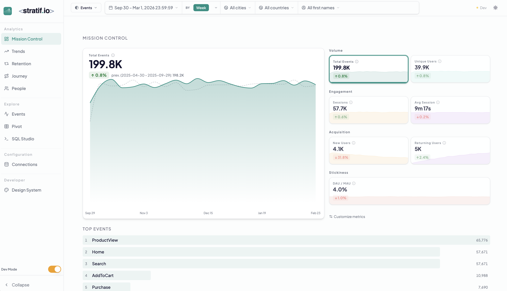

<div align="center">
  <picture>
    <source media="(prefers-color-scheme: dark)" srcset="docs/logo-dark.svg"/>
    
  </picture>

[](LICENSE)
[](pyproject.toml)
[](package.json)
[](https://github.com/stratif-io/stratif.io/pkgs/container/stratif.io)

**Your events are already in your warehouse. Connect directly — no pipelines, no ingestion, no vendor lock-in.**

[Website](https://stratif.io) · [Quick Start](#-quick-start) · [Docs](docs/docs.md) · [Contributing](CONTRIBUTING.md)

</div>

---

<picture>
  <source media="(prefers-color-scheme: dark)" srcset="docs/mc_dark.png"/>
  
</picture>

---

## Why stratif.io?

**Your events are already in your warehouse. Stop sending them somewhere else.** Every SaaS analytics platform makes you re-pipe your data into their system — creating vendor lock-in, duplicating data, and adding cost. stratif.io connects directly to your existing DuckDB, Postgres, Snowflake, or ClickHouse. No ingestion. No pipelines. No data ever leaves your infrastructure.

**Open source and self-hosted.** No vendor lock-in, no surprise invoices. One install script and you own your analytics stack completely.

**Learn product analytics hands-on.** stratif.io ships with ~5,000 realistic sample events. Explore funnels, retention, and user journeys without needing your own data — no account, no credit card.

---

## ⚡ Quick Start

```bash
curl -fsSL https://stratif.io/install.sh | sh
```

Open **http://localhost:8000** when it's done. For Docker Compose and advanced setup, see [Docs](docs/docs.md).

---

## 🗄️ Supported Databases

DuckDB · SQLite · PostgreSQL · ClickHouse · Snowflake · Databricks

- **Point stratif.io at your database** — one row per event, with a timestamp, a user ID, and an event name
- **Select your events table** — any additional columns are picked up automatically as filterable properties
- **Explore** funnels, retention, journeys, sessions, and SQL directly in the UI

---

## 📊 Comparison

|                                 | stratif.io | Amplitude / Mixpanel | PostHog | Warehouse-native SaaS\* |
| ------------------------------- | :--------: | :------------------: | :-----: | :---------------------: |
| Open source                     |     ✅     |          ❌          |   ✅    |           ❌            |
| Self-hosted                     |     ✅     |          ❌          |   ✅    |           ❌            |
| Warehouse-native (no ingestion) |     ✅     |          ❌          |   ❌    |           ✅            |
| Free                            |     ✅     |          ❌          |   ❌    |           ❌            |
| Sample data to learn with       |     ✅     |          ❌          |   ❌    |           ❌            |

_\* Mitzu, Kubit, NetSpring, Houseware — all closed-source, cloud-only, paid._

---

PRs welcome. See [CONTRIBUTING.md](CONTRIBUTING.md).

**License:** Elastic License 2.0 © Carlo Abi Chahine

---

Built on the shoulders of giants — [React](https://react.dev), [FastAPI](https://fastapi.tiangolo.com), [SQLGlot](https://github.com/tobymao/sqlglot), [shadcn/ui](https://ui.shadcn.com), [TanStack Query](https://tanstack.com/query), [Zustand](https://zustand-demo.pmnd.rs), [Recharts](https://recharts.org), [Tailwind CSS](https://tailwindcss.com).
